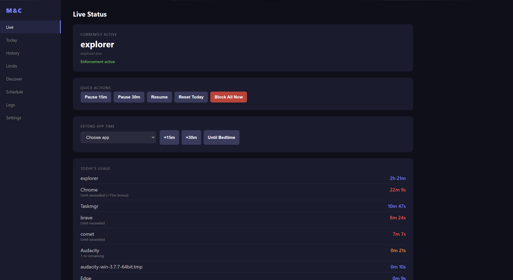
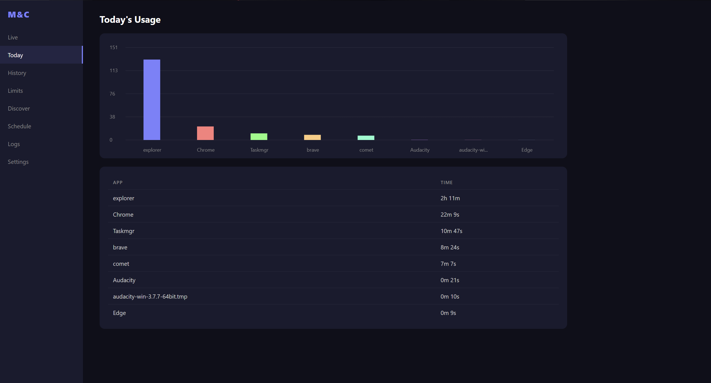
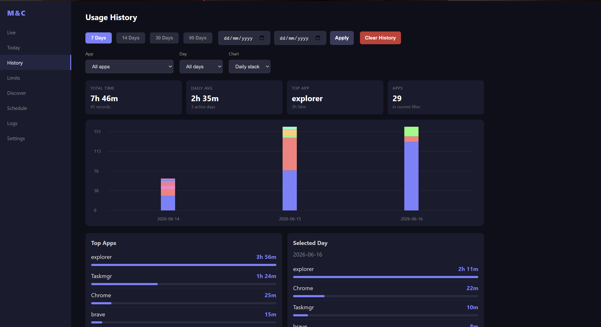
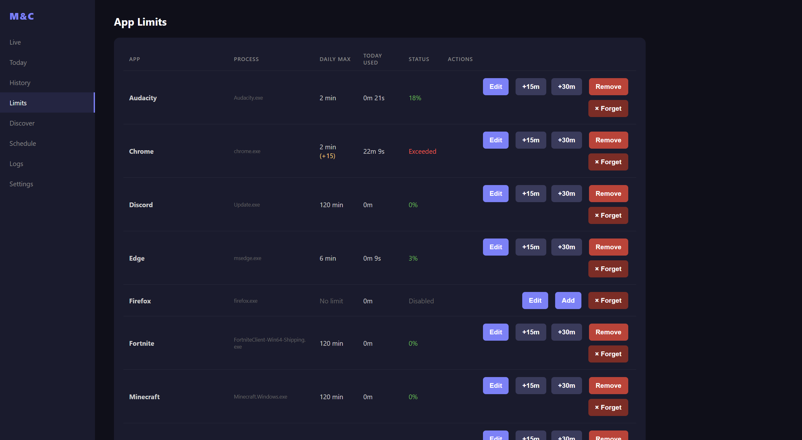
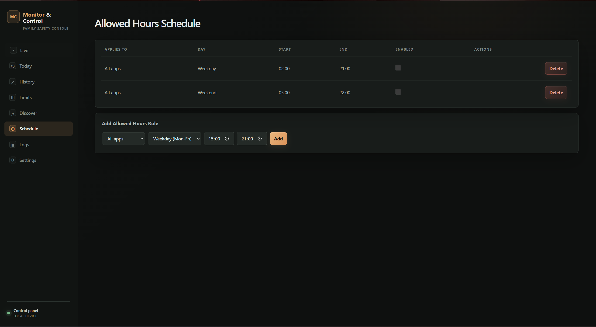
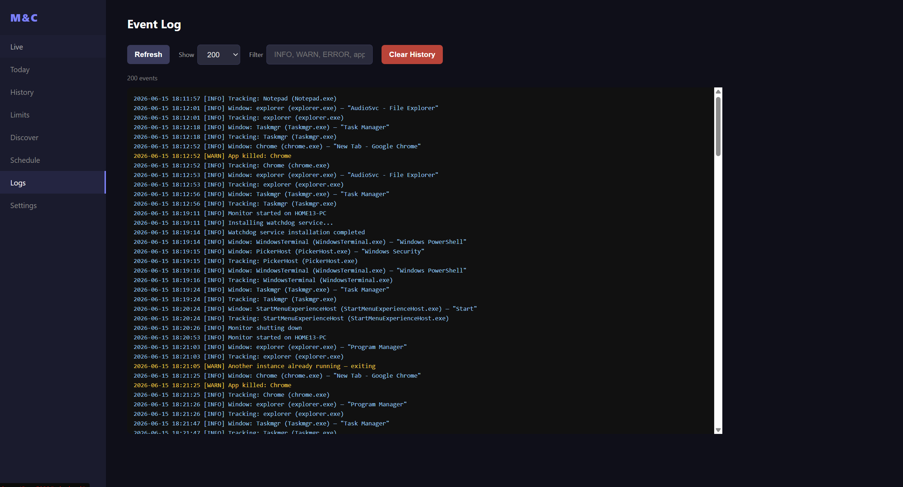

# 🖥️ Monitor & Control
### Free Parental Control App for Windows

**Track. Limit. Protect.**  
Set daily screen time limits per app, enforce schedules,  
and monitor usage — all from a beautiful web dashboard.

## 💡 Why Monitor & Control?

| Problem | Our Solution |
|---------|-------------|
| 😤 Kids play games all night | ⏰ Auto-close apps when time limit is reached |
| 🎮 Hard to track which games they play | 📊 Real-time dashboard with usage charts |
| 😴 Gaming during school hours | 📅 Schedule rules (e.g. only 15:00–21:00) |
| 🏃 Kids close the app | 🛡️ Watchdog service auto-restarts it |
| 📧 Not home to check | 📨 Email alerts & remote commands via Gmail |
| 🌍 Language barrier | 🗣️ English, German, Spanish, French, Russian |

---

> 👨‍👩‍👧 **For parents** who want to manage their children's gaming time  
> without intrusive restrictions — runs silently in the background.

## Features

- **Shared limit groups** — combine apps such as games into one daily allowance; simultaneous group members consume the shared pool only once

- **Real‑time usage tracking** — counts foreground use by default, with optional per-app background tracking
- **Concurrent app accounting** — a foreground game and opted-in background communication apps can accumulate time simultaneously
- **Overlay focus filtering** — prevents voice and notification overlays from being mistaken for deliberate app switches
- **Lock and idle awareness** — tracking always pauses on the Windows lock screen, with optional configurable idle suspension
- **Tracking diagnostics** — shows which processes are counted, ignored, paused, or running without background permission
- **Scheduled parent summaries** — optional daily, weekly, or monthly email reports with automatic next-start catch-up
- **Tamper alerts** — optional email/webhook alerts for deleted data/config, clock changes, watchdog failure, and repeated login failures
- **Daily time limits** — set per‑app limits (e.g. Fortnite 120 min/day); apps are auto‑closed when exceeded
- **Graceful countdown** — full‑screen warning popup with countdown before an app is killed
- **Bonus time** — grant extra minutes from the dashboard without changing limits
- **Schedule rules** — define allowed hours per app (e.g. weekdays 15:00–21:00)
- **Auto‑detection** — scan the system for installed games/apps and add them with one click
- **Web dashboard** — responsive SPA with live status, usage charts, history, logs, and settings
- **Multi‑language** — English, German, Spanish, French, Russian (auto‑translates the dashboard UI)
- **Email control** — receive alerts and send commands via Gmail (optional)
- **Webhook alerts** — POST JSON to a custom endpoint on limit breach
- **Watchdog service** — optional Windows service that restarts the monitor if it crashes
- **Admin password** — protect dashboard changes and shutdown
- **Remote dashboard login** — remote users are redirected to a login page; authenticated sessions use an HTTP-only cookie and can be explicitly logged out
- **Secure defaults** — the dashboard binds to localhost by default, and remote API access is denied until an administrator authenticates
- **Config export/import** — backup and restore limits, schedules, app mappings, and tracking policies
- **Hotkey** — `Ctrl+Alt+H` opens the dashboard by default and can be changed in Settings

---

## Screenshots








---

## How It Works

Monitor & Control consists of three executables:

| Component | File | Description |
|-----------|------|-------------|
| **Monitor** | `DeviceMon.exe` | Main application — tracks usage, enforces limits, hosts the web dashboard |
| **Watchdog** | `GameHost.exe` | Windows service that restarts the monitor if it crashes. **Auto-installs when you run DeviceMon.exe** — it prompts for admin elevation once, then runs silently in the background |
| **PopupHost** | `PopupHost.exe` | Child process launched by the monitor to show full‑screen warning popups with countdown |

> **Note on executable names:** `DeviceMon.exe` is the Monitor & Control app and `GameHost.exe` is the watchdog. The names are intentionally generic to avoid drawing attention on a child's PC — keeping them as-is is recommended.  
> If you must rename them, you'll need to edit the corresponding constants in `Program.cs` (e.g., `AppName`, `WatchdogServiceName`, `WatchdogExeName`) and `Watchdog/Program.cs` (e.g., `ServiceName`, `MonitorExeName`, `WatchdogExeName`), then rebuild. There's no configuration file for this — the names are baked into the code.

### Watchdog — how auto-install works

When you run `DeviceMon.exe`, it automatically looks for `GameHost.exe` in the same folder. If the watchdog service is not installed (or needs updating), DeviceMon silently asks for administrator privileges via a UAC prompt and installs/updates it. After that:
- The watchdog runs as a Windows service named `GameHost`
- It checks every 15 seconds whether `DeviceMon.exe` is still running
- If the monitor process is missing, the watchdog relaunches it in the active user session
- No further UAC prompts — the service runs under the SYSTEM account
- If you ever want to remove it, see the [Watchdog uninstall](#installing-the-watchdog-optional-requires-admin) section

### Data storage

- **SQLite database** at `%LOCALAPPDATA%\SystemHelper\monitor.db` — usage records, limits, schedules, app tracking policies, settings
- **Log file** at `%LOCALAPPDATA%\SystemHelper\monitor.log`
- **Watchdog log** at `C:\ProgramData\SystemHelper\watchdog.log`
- **Configuration** at `appsettings.json` (alongside the exe)

### Usage tracking modes

Tracking behavior is configured independently for every process using the **Background** and **Filter overlays** columns in the Limits table. Both options are off by default. The checkboxes save immediately and do not require the application to have a daily limit.

| Option | Behavior |
|--------|----------|
| **Foreground only** | Default mode. Time is counted while the application's window is the accepted foreground window. |
| **Count while running in background** | Counts time whenever the configured process is running, including while minimized or behind another application. |
| **Ignore voice/notification overlay focus** | Rejects short or unattended focus changes from non-main overlay windows. A genuine switch to the application's main window must be stable and associated with recent keyboard or mouse input. |

Background accounting is concurrent. For example, if a game is in the foreground while Discord, Telegram, Signal, Skype, Teams, Zoom, or another opted-in application is running, the same elapsed second can be added to both applications. An application is counted only once per sample even if it is both foreground and enabled for background tracking.

When several executables map to the same app name, they share one usage total and limit. Reaching that limit closes every running executable mapped to the app, not only the first process.

### Shared limit groups

The Limits page can combine tracked applications into a named group such as **Games** with one shared daily allowance. Time used by any member consumes the group pool. If multiple members run simultaneously, the group records real elapsed time only once instead of adding every member's duration. An app can belong to at most one group and may still have an individual limit; reaching either limit blocks that app. A group breach shows one countdown for the group, closes running members, and blocks every member for the rest of the day. Shared group totals appear separately in Today and History so they are not added to individual-app totals. Group definitions are included in configuration export/import, and importing definitions preserves existing group history and today's consumed allowance.

> **Important:** Background mode measures process runtime, not microphone activity. An application left open but unused continues accumulating time, and its daily limit can be reached while it remains in the background.

Usage is sampled approximately once per second using a monotonic clock. Large timing gaps caused by sleep, hibernation, or a stalled process are discarded instead of being charged as usage. Accumulated time is persisted according to `FlushIntervalSec`.

Tracking always pauses while the Windows desktop is locked. **Settings → Pause all usage tracking when idle** can optionally pause foreground and background accounting after 1–240 minutes without keyboard or mouse input; it is disabled by default because controllers, video playback, and voice calls may not generate normal Windows input.

The Live tab's **Tracking Diagnostics** card explains each running configured process: counted as foreground, counted in background, not counted because background mode is disabled, or paused because Windows is locked/the user is idle.

The dashboard uses a responsive premium control-console layout: a live activity hero, asymmetric diagnostics/usage cards, an action dock, icon navigation, grouped settings panels, compact data tables, and horizontal mobile navigation. Purpose-specific cyan, violet, amber, blue, green, and red accents distinguish content and actions. Staggered entrances, card depth, animated charts, button highlights/click ripples, and a gently animated live visual add polish while honoring the operating system's reduced-motion preference.

Settings action rows are responsive, including a custom backup-file picker that shows one truncated filename without duplicating the browser's native file status.

### Scheduled summaries and tamper alerts

Both features are disabled by default and configured under **Settings → Scheduled Reports & Security Alerts**. Summaries support daily, weekly, or monthly delivery using the computer's local time. Weekly reports have a weekday selector; monthly reports accept days 1–31 and automatically use the month's last valid day when necessary.

If the computer is off at the scheduled time, the app sends only the latest missed period after the next startup. The due period is marked complete only after email delivery succeeds. Summary email requires Gmail credentials but does not require breach-notification email to be enabled.

Tamper alerts use every configured channel available: email and webhook. Alerts are deduplicated while a condition remains active and cover missing database/config files, clock jumps of at least five minutes, an unavailable/stopped watchdog, watchdog recovery after DeviceMon was terminated, and dashboard login lockouts after repeated failures. Watchdog-restart delivery is attempted three times; its marker is retained after repeated failure so it can be retried after the next startup. Routine app-start emails are suppressed for two minutes after watchdog recovery so they do not obscure the tamper event.

Limit notification emails have separate switches for **limit reached** (the countdown begins) and **app closed** (enforcement completed). Webhooks already use distinct `limit_breach` and `app_killed` event types. Existing installations migrate the former combined email switch to both new switches until the parent saves new preferences.

Email commands are acknowledged separately by every DeviceMon installation instead of relying on Gmail's shared read/unread flag. Therefore a broadcast such as `mc: status` is processed once by every configured computer, while `mc: @device-id status` is processed only by its target. On the first run after upgrading, previously read commands are recorded without replaying them.

The **app closed by enforcement** email switch applies to limited apps that DeviceMon terminates. It does not report DeviceMon itself being terminated; enable **Tamper alerts** for watchdog recovery emails after DeviceMon is forcibly closed.

The **Today** and **History** tabs include a **Show foreground/background breakdown** checkbox. When enabled, charts use stacked foreground and background segments and tables show Foreground, Background, and Total columns. If an opted-in background app becomes the accepted foreground app, that interval is classified only as foreground and is never double-counted.

Usage recorded by an older release has only a total and cannot be reconstructed by source. After upgrading, that time is shown as **Legacy** / **unclassified** in breakdown mode while its original total remains unchanged. New usage is classified fully.

Existing databases are upgraded automatically. Tracking policies are also included in configuration exports and restored during import.

`DefaultLimits` and `Schedule` from `appsettings.json` are imported only when the SQLite database is created for the first time. After initialization, the database is authoritative: limits or schedules removed in the dashboard remain removed after restart. Delete `%LOCALAPPDATA%\SystemHelper\monitor.db` only when you intentionally want a fresh first-start import.

---

## Section A — For Developers: Building from Source

### Prerequisites

- [.NET 8 SDK](https://dotnet.microsoft.com/en-us/download/dotnet/8.0) (any platform that supports `net8.0-windows`)

### Build & publish

```powershell
# Publish all components (framework‑dependent, ~2 MB each)
.\publish.ps1

# Output goes to: bin\Release\net8.0-windows\win-x64\publish\
```

The script publishes four projects:
1. `MonitorAndControl.csproj` → `DeviceMon.exe`
2. `Watchdog\SystemHelperWatchdog.csproj` → `GameHost.exe`
3. `PopupHost\PopupHost.csproj` -> `PopupHost.exe`
4. `UpdateAgent\UpdateAgent.csproj` -> `UpdateAgent.exe`

It also copies `appsettings.json`, the `wwwroot/` folder, and PowerShell helper scripts.

### Publish options

```powershell
# Self‑contained (includes .NET runtime, ~50 MB, no runtime needed on target)
dotnet publish .\MonitorAndControl.csproj -c Release -r win-x64 --self-contained true -p:PublishSingleFile=true

# Framework‑dependent (requires .NET 8 Runtime on target)
dotnet publish .\MonitorAndControl.csproj -c Release -r win-x64 --self-contained false -p:PublishSingleFile=true
```

### Project structure

```
MonitorAndControl/
├── Program.cs              # Entry point, DI, startup
├── appsettings.json        # Default configuration
├── Data/
│   └── UsageDatabase.cs    # SQLite data layer
├── Models/                 # Data models (AppConfig, AppLimitRule, ScheduleRule, etc.)
├── Services/
│   ├── Logger.cs           # File‑based logger
│   ├── Localization.cs     # .resx string localization
│   ├── WindowTracker.cs    # Foreground polling, app policies, overlay filtering
│   ├── UsageTracker.cs     # Concurrent foreground/background usage accumulation
│   ├── LimitEnforcer.cs    # Limit checking + kill logic
│   ├── SchedulerService.cs # Time‑based schedule enforcement
│   ├── NotificationService.cs  # Webhook notifications
│   ├── EmailService.cs     # Gmail SMTP/IMAP integration
│   ├── HotKeyService.cs    # Global dashboard hotkey
│   ├── PasswordHasher.cs   # PBKDF2 password hashing
│   ├── SecretProtector.cs  # DPAPI credential protection
│   └── DiscoveryService.cs # Scans for installed games/apps
├── UI/
│   └── HiddenForm.cs       # System tray icon + hotkey form
├── Web/
│   ├── DashboardServer.cs  # ASP.NET Minimal API (REST + SSE)
│   └── wwwroot/            # SPA dashboard (HTML, JS, CSS, i18n JSON)
├── Resources/              # .resx localization files
├── PopupHost/              # Warning popup child process
|-- UpdateAgent/            # Self-update helper launched from dashboard
├── Watchdog/               # Windows service watchdog
└── Tests/                  # Unit tests
```

### Running from source

```powershell
dotnet run --project .\MonitorAndControl.csproj
```

Opens the dashboard at `http://localhost:5000` and runs in the system tray.

---

## Section B — For End Users: Using Pre‑Built Releases

### Quick start

1. **Download** the latest release from the [Releases](https://github.com/geogengames-hue/MonitorAndControl/releases) page (all three `.exe` files must be kept together in the same folder)
2. **Extract** the zip to a folder (e.g. `C:\MonitorAndControl`)
3. **Run `DeviceMon.exe`** (no admin required for basic usage)
   - On first run, it will detect `GameHost.exe` and ask for **administrator elevation** via a UAC prompt to install the watchdog service. This is optional — click **Yes** to enable auto-restart on crash, or **No** to skip (the app will still run normally)
4. **Open the dashboard** — press `Ctrl+Alt+H` by default or open `http://localhost:5000` in a browser
5. **Configure apps** — navigate to **Limits**, optionally set daily limits, and use the inline Background and Filter overlays checkboxes for any tracked process
6. **Configure schedule** (optional) — navigate to **Schedule** tab, set allowed hours

For remote access from another PC on the same network, see `appsettings.json` configuration below.

### Configuration (`appsettings.json`)

Place this file alongside `DeviceMon.exe`. All settings are optional — defaults are used when a key is missing.

```json
{
  "DashboardPort": 5000,
  "EnableRemoteDashboard": true,
  "DashboardBindAddress": "0.0.0.0",
  "KillDelaySeconds": 30,
  "ShowWarningOnChildPc": true,
  "PollIntervalMs": 1000,
  "FlushIntervalSec": 30,
  "HotKeyModifiers": "Control+Alt",
  "HotKeyKey": "H",
  "KnownApps": {
    "FortniteClient-Win64-Shipping.exe": "Fortnite",
    "RobloxPlayerBeta.exe": "Roblox",
    "Minecraft.Windows.exe": "Minecraft",
    "chrome.exe": "Chrome"
  },
  "DefaultLimits": [
    { "AppName": "Fortnite", "DailyMaxMinutes": 120 },
    { "AppName": "Roblox", "DailyMaxMinutes": 90 }
  ],
  "Schedule": [
    { "DayOfWeek": "Weekday", "StartTime": "15:00", "EndTime": "21:00" },
    { "DayOfWeek": "Weekend", "StartTime": "09:00", "EndTime": "22:00" }
  ]
}
```

| Key | Default | Description |
|-----|---------|-------------|
| `DashboardPort` | `5000` | Port for the web dashboard |
| `EnableRemoteDashboard` | `false` | Allow access from other PCs on the network |
| `DashboardBindAddress` | `127.0.0.1` | Bind address (`0.0.0.0` for all interfaces) |
| `KillDelaySeconds` | `30` | Seconds between limit breach warning and closing the app |
| `ShowWarningOnChildPc` | `true` | Show full‑screen popup before killing an app |
| `PollIntervalMs` | `1000` | Foreground window check interval (ms) |
| `FlushIntervalSec` | `30` | How often sampled usage is written to the database and limits are evaluated |
| `HotKeyModifiers` | `Control+Alt` | Default modifier keys for the dashboard hotkey. Can also be changed in dashboard Settings. |
| `HotKeyKey` | `H` | Default key for the dashboard hotkey. Can also be changed in dashboard Settings. |
| `KnownApps` | `{}` | Map of process names → friendly app names |
| `DefaultLimits` | `[]` | Daily limits imported only when the database is first created |
| `Schedule` | `[]` | Allowed-hours rules imported only when the database is first created |

> **Security note:** When remote access is enabled, remote users cannot open the dashboard until an admin password has been created from a trusted local dashboard. After setup, remote users are redirected to the login page. Successful authentication creates an HTTP-only session cookie; use **Settings → Logout** to end that browser session.

### Installing the Watchdog (optional, requires admin)

**Normally you don't need to do this manually** — when you run `DeviceMon.exe`, it auto-detects `GameHost.exe` in the same folder and offers to install the watchdog service with a single UAC prompt.

Manual install is only needed if you want to install the watchdog separately (e.g., deploying to a different folder after the fact):

```powershell
# Run PowerShell as Administrator, then:
.\install-watchdog.ps1

# Or specify a custom publish folder:
.\install-watchdog.ps1 -PublishDir "C:\MonitorAndControl"
```

To remove the watchdog:

```powershell
.\GameHost.exe --uninstall
# or
.\uninstall-watchdog.ps1
```

Once installed, the `GameHost` service runs under the SYSTEM account and automatically restarts `DeviceMon.exe` if it crashes — no further UAC prompts needed.

### Using the dashboard

**Navigation:**

| Tab | Description |
|-----|-------------|
| **Live** | Currently active app, tracking diagnostics, quick actions (pause, resume, block all, extend time) |
| **Today** | Bar chart and table of today's total usage, with optional foreground/background breakdown |
| **History** | Historical totals and foreground/background breakdown with filters, charts, and stats (7/14/30/90 days or custom range) |
| **Limits** | One combined table with per-process background/overlay checkboxes, optional daily limits, bonus time, status, and app management |
| **Discover** | Scan system for installed games/apps, add them with default limit |
| **Schedule** | Time‑based allowed hours rules per app |
| **Logs** | Real‑time event log with filtering |
| **Settings** | Kill delay, optional idle suspension, language, dashboard hotkey, auto-start, webhook, email, app update, admin password, backup/restore, health |

**Admin password:** On first setup, create it from the trusted local dashboard on the child PC. Remote browsers are then redirected to `login.html` and must authenticate before dashboard assets are served. The authenticated session is stored in an HTTP-only, SameSite cookie. Use **Settings → Logout** to clear it. The password also protects dashboard changes (pause, resume, reset, kill, settings edits) and shutdown.

**App update:** Put a freshly published package in a local folder or UNC share, or provide an HTTPS ZIP URL with its exact SHA-256, then use **Settings -> App Update**. HTTP URLs are rejected. For Windows 11 SMB shares, enter the optional SMB username/password. The updater requests administrator approval, verifies remote ZIP contents before extraction, writes its marker in an administrator/SYSTEM-only directory, closes DeviceMon, copies the package, restarts DeviceMon, and repairs the watchdog. Check `update.log` in the install folder if an update fails.

**Reset Today:** Resetting today's usage is synchronized with the tracking flush and clears both persisted and pending app/group counters, so pre-reset seconds cannot reappear later.

**Remote access:** Settings show the computer name and IP addresses. From another PC, open `http://CHILD_PC_NAME:5000` or `http://192.168.x.x:5000`.

### Email control (optional)

1. Enable 2‑Factor Authentication on your Gmail account
2. Generate an [App Password](https://support.google.com/accounts/answer/185833)
3. Configure in **Settings** → **Email Notifications & Control**
4. Reply to any alert email with one of these commands (prefix with `mc:` or `monitor:`):

| Command | Example | Description |
|---------|---------|-------------|
| `help` | `mc: help` | Shows all available commands |
| `status` | `mc: status` | Current app/process, limits, schedule, and the top eight apps used today |
| `@device command` | `mc: @bedroom status` | Run a command only on the PC with that Device ID |
| `set [app] [min] min` | `mc: set Fortnite 60 min` | Set daily limit for an app |
| `bonus [app] [min] min` | `mc: bonus Fortnite 15 min` | Add bonus time today |
| `extend [app] until bedtime` | `mc: extend Fortnite until bedtime` | Extend until end of allowed window |
| `set schedule [day] [start]-[end]` | `mc: set schedule weekday 22:00-06:00` | Add a schedule rule |
| `set kill-delay [sec]` | `mc: set kill-delay 60` | Change the kill delay |
| `add [process.exe] [name]` | `mc: add aces.exe Aces` | Register a new app to track |

Examples:
```
mc: status
mc: set Fortnite 120 min
mc: bonus Roblox 30 min
mc: extend Minecraft until bedtime
mc: set schedule weekend 09:00-22:00
mc: set kill-delay 30
mc: add chrome.exe Chrome
```

### Uninstallation

1. Remove the watchdog (if installed): run `GameHost.exe --uninstall` as Administrator
2. Delete the application folder
3. (Optional) Delete data: `%LOCALAPPDATA%\SystemHelper\`

---

## Translations

Supports English, German, Spanish, French, and Russian.

- **Dashboard UI:** Translated via JSON files in `Web/wwwroot/i18n/`
- **Warning popups:** Translated via `.resx` files in `Resources/`
- The language can be changed in **Settings** → **Language** (reloads the page)

To add a new language:
1. Copy `Web/wwwroot/i18n/en.json` → `Web/wwwroot/i18n/{code}.json` and translate the values
2. Copy `Resources/Strings.resx` → `Resources/Strings.{code}.resx` and translate the values
3. Add the option to the language `<select>` in `Web/wwwroot/index.html`

---

## FAQ / Troubleshooting

**Q: The dashboard shows "?" instead of accented characters.**
A: Your JSON translation files may have been saved with the wrong encoding. Ensure all files in `Web/wwwroot/i18n/` are saved as **UTF-8**.

**Q: The watchdog service won't install.**
A: Run PowerShell **as Administrator**. The service requires elevation to create a Windows service.

**Q: I can't access the dashboard from another PC.**
A: Set `EnableRemoteDashboard` to `true` and `DashboardBindAddress` to `"0.0.0.0"` in `appsettings.json`. Ensure the Windows Firewall allows port 5000.

**Q: How do I reset all usage data?**
A: Delete the SQLite database at `%LOCALAPPDATA%\SystemHelper\monitor.db` while the monitor is not running. It will be recreated on next launch.

**Q: Where are logs stored?**
A: `%LOCALAPPDATA%\SystemHelper\monitor.log` for the main app, and `C:\ProgramData\SystemHelper\watchdog.log` for the watchdog service.

**Q: Can I run it without the web dashboard?**
A: No. The web dashboard is the primary UI.

**Q: DeviceMon.exe crashes on startup or won't launch.**
A: Make sure the .NET 8 Runtime is installed (see [Releases](https://github.com/geogengames-hue/MonitorAndControl/releases) for the link). Check `%LOCALAPPDATA%\SystemHelper\monitor.log` for errors. Try deleting the database file if it's corrupt.

**Q: The app runs but the dashboard won't load in my browser.**
A: Confirm nothing else is using port 5000. Run `netstat -aon | findstr :5000` in a terminal. If another process owns it, change the `DashboardPort` in `appsettings.json` and restart DeviceMon.exe.

**Q: Port 5000 is already in use. How do I change it?**
A: Add `"DashboardPort": 5001` (or any free port) to `appsettings.json` and restart DeviceMon. Then open `http://localhost:5001`.

**Q: How do I update to a newer version?**
A: Download the latest release ZIP, extract it to a folder. Go to **Settings → App Update** on the dashboard, point to the folder/UNC path/HTTP zip URL, and click Update. The app will close itself, copy the new files, and restart. See [App update](#using-the-dashboard) for details.

**Q: Some games/apps show as "Unknown App" even though they're running.**
A: The app only recognizes processes it has seen before. Add the unknown process from the **Discover** tab (auto-detect) or manually via **Limits → Add App**. You can also pre-map them in `appsettings.json` under `KnownApps`.

**Q: Why does the log alternate between my game and Discord/Telegram while the game stays visible?**
A: A voice or notification overlay can temporarily be reported by Windows as the foreground window. In the **Limits** table, enable **Filter overlays** for that process. The tracker will ignore non-main overlay windows and require a stable, recently user-initiated switch before changing the foreground app.

**Q: How do I count Discord, Telegram, Signal, Skype, Teams, Zoom, or another app while a game is active?**
A: Add the application through **Discover** or the Limits form, then enable **Background** for its process directly in the Limits table. This setting is generic and does not require a daily limit. The foreground game and background application will accumulate time concurrently.

**Q: Does background tracking detect when the microphone or a voice call is active?**
A: No. It counts whenever the configured process is running. This avoids application-specific microphone integrations, but it also means minimized or idle applications continue accumulating time until their process exits. Leave background tracking disabled when process runtime is not the behavior you want.

**Q: Can background tracking cause an application to reach its daily limit while minimized?**
A: Yes. Background-counted time uses the same daily usage total and limit enforcement as foreground time. Close the application when it is not being used, increase its limit, or disable background tracking.

**Q: Why is a running app not accumulating time?**
A: Open **Live → Tracking Diagnostics**. It shows whether the process is foreground, allowed in background, paused by the lock screen/idle setting, or simply running without background tracking enabled.

**Q: Does tracking continue while Windows is locked or the PC is idle?**
A: It always pauses while Windows is locked. Idle pausing is optional and disabled by default; enable it and choose a threshold in **Settings** if desired. Be cautious on PCs used with controllers, videos, or voice calls because those activities may not reset the Windows keyboard/mouse idle timer.

**Q: How do I set up email notifications?**
A: Enable 2FA on your Gmail account, generate an [App Password](https://support.google.com/accounts/answer/185833), and enter your Gmail address and the app password in **Settings → Email Notifications & Control**. See the [Email control](#email-control-optional) section for all commands.

**Q: Can I monitor multiple children on different PCs?**
A: Yes. Install the app on each child's PC and give each a unique **Device ID** in **Settings**. Emails include the device name, and you can target a specific PC with `mc: @bedroom status`. Each PC needs its own Gmail address or you can forward to a single inbox.

**Q: Does it work with Windows Store / UWP apps (e.g. Minecraft from the Store)?**
A: Yes. UWP apps appear as the background process that owns the window. The Discover tab should detect them. If not, manually add the executable name (e.g. `Minecraft.Windows.exe`) via **Limits → Add App**.

**Q: My child renamed DeviceMon.exe to bypass limits.**
A: The **watchdog service** (`GameHost.exe`) runs under SYSTEM account and tracks the monitor regardless of its filename. You can also set an **admin password** in Settings to prevent dashboard tampering. Physical access to the PC is ultimately controlled by the Windows user account permissions.

**Q: Can I pause monitoring temporarily without stopping the app?**
A: Yes. Click the **Pause** button on the dashboard **Live** tab or from the system tray icon context menu. Click **Resume** to continue tracking.

**Q: What happens when I close DeviceMon.exe?**
A: If the watchdog is installed, it restarts DeviceMon.exe within 15 seconds. To fully stop, uninstall the watchdog first (`GameHost.exe --uninstall` as Admin), then close DeviceMon.

**Q: Does the app work offline / without internet?**
A: Yes. The dashboard and all monitoring features work entirely locally. Only email notifications/control require internet access.

---

## License

Fair Use License — see the [LICENSE](LICENSE) file for details.

- ✅ Free for personal, educational, and non‑commercial use
- ✅ Modify and distribute with attribution
- ❌ No selling, commercial redistribution, or republishing on app stores/public repositories
